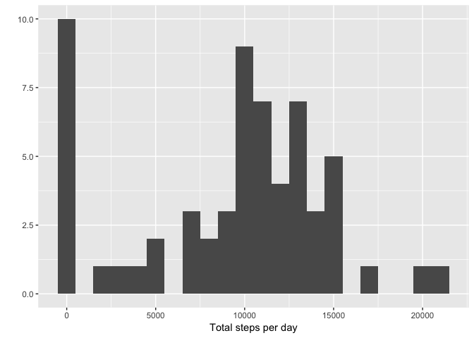
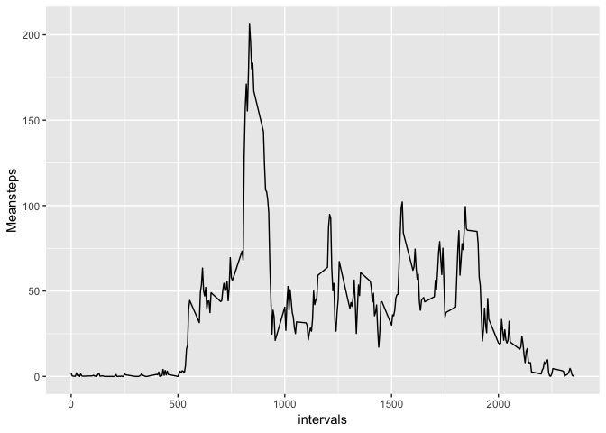
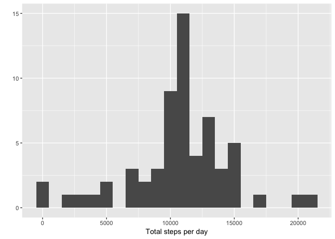

## Loading and preprocessing the data

#### 1. Load the data (i.e. read.csv() )


```r
data <- read.csv("activity.csv", header = TRUE)
str(data)
```

```
## 'data.frame':	17568 obs. of  3 variables:
##  $ steps   : int  NA NA NA NA NA NA NA NA NA NA ...
##  $ date    : Factor w/ 61 levels "2012-10-01","2012-10-02",..: 1 1 1 1 1 1 1 1 1 1 ...
##  $ interval: int  0 5 10 15 20 25 30 35 40 45 ...
```


## What is mean total number of steps taken per day?

#### 1. Calculate the total number of steps taken per day


```r
total.steps <- tapply(data$steps, data$date, FUN = sum, na.rm = TRUE)
print(data.frame(Date=unique(data$date),
                 TotalSteps=total.steps))
```

```
##                  Date TotalSteps
## 2012-10-01 2012-10-01          0
## 2012-10-02 2012-10-02        126
## 2012-10-03 2012-10-03      11352
## 2012-10-04 2012-10-04      12116
## 2012-10-05 2012-10-05      13294
## 2012-10-06 2012-10-06      15420
## 2012-10-07 2012-10-07      11015
## 2012-10-08 2012-10-08          0
## 2012-10-09 2012-10-09      12811
## 2012-10-10 2012-10-10       9900
## 2012-10-11 2012-10-11      10304
## 2012-10-12 2012-10-12      17382
## 2012-10-13 2012-10-13      12426
## 2012-10-14 2012-10-14      15098
## 2012-10-15 2012-10-15      10139
## 2012-10-16 2012-10-16      15084
## 2012-10-17 2012-10-17      13452
## 2012-10-18 2012-10-18      10056
## 2012-10-19 2012-10-19      11829
## 2012-10-20 2012-10-20      10395
## 2012-10-21 2012-10-21       8821
## 2012-10-22 2012-10-22      13460
## 2012-10-23 2012-10-23       8918
## 2012-10-24 2012-10-24       8355
## 2012-10-25 2012-10-25       2492
## 2012-10-26 2012-10-26       6778
## 2012-10-27 2012-10-27      10119
## 2012-10-28 2012-10-28      11458
## 2012-10-29 2012-10-29       5018
## 2012-10-30 2012-10-30       9819
## 2012-10-31 2012-10-31      15414
## 2012-11-01 2012-11-01          0
## 2012-11-02 2012-11-02      10600
## 2012-11-03 2012-11-03      10571
## 2012-11-04 2012-11-04          0
## 2012-11-05 2012-11-05      10439
## 2012-11-06 2012-11-06       8334
## 2012-11-07 2012-11-07      12883
## 2012-11-08 2012-11-08       3219
## 2012-11-09 2012-11-09          0
## 2012-11-10 2012-11-10          0
## 2012-11-11 2012-11-11      12608
## 2012-11-12 2012-11-12      10765
## 2012-11-13 2012-11-13       7336
## 2012-11-14 2012-11-14          0
## 2012-11-15 2012-11-15         41
## 2012-11-16 2012-11-16       5441
## 2012-11-17 2012-11-17      14339
## 2012-11-18 2012-11-18      15110
## 2012-11-19 2012-11-19       8841
## 2012-11-20 2012-11-20       4472
## 2012-11-21 2012-11-21      12787
## 2012-11-22 2012-11-22      20427
## 2012-11-23 2012-11-23      21194
## 2012-11-24 2012-11-24      14478
## 2012-11-25 2012-11-25      11834
## 2012-11-26 2012-11-26      11162
## 2012-11-27 2012-11-27      13646
## 2012-11-28 2012-11-28      10183
## 2012-11-29 2012-11-29       7047
## 2012-11-30 2012-11-30          0
```


#### 2. Make a histogram of the total number of steps taken each day


```r
library(ggplot2)
```

```
## Warning: package 'ggplot2' was built under R version 3.4.4
```


```r
qplot(total.steps, binwidth = 1000, xlab = "Total steps per day")
```

<!-- -->


#### 3. Calculate and report the mean and median total number of steps taken per day

```r
mean(total.steps, na.rm = TRUE)
```

```
## [1] 9354.23
```

```r
median(total.steps, na.rm = TRUE)
```

```
## [1] 10395
```

## What is the average daily activity pattern?

#### 1. Make a time series plot (i.e. type="l") of the 5-minute interval (x-axis) and the average number of steps taken, averaged across all days (y-axis)


```r
average <- aggregate(x = list(Meansteps = data$steps), by = list(interval = data$interval), 
    FUN = mean, na.rm = TRUE)
ggplot(data = average, aes(x = interval, y = Meansteps)) + geom_line() + xlab("intervals")
```

<!-- -->

#### 2. Which 5-minute interval, on average across all the days in the dataset, contains the maximum number of steps?


```r
maxi <- average[order(-average$Meansteps),]
head(maxi)
```

```
##     interval Meansteps
## 104      835  206.1698
## 105      840  195.9245
## 107      850  183.3962
## 106      845  179.5660
## 103      830  177.3019
## 101      820  171.1509
```

The maximum number of steps (aprox 206 steps) is containig in `835` 5-minute interval.


## Imputing missing values

#### 1. Calculate and report the total number of missing values in the dataset (i.e. the total number of rows with \color{red}{\verb|NA|}NAs)


```r
index.NA <- is.na(data$steps)
total.NA <- sum(index.NA)
total.NA
```

```
## [1] 2304
```

The number of missins values is `2304`

#### 2. Devise a strategy for filling in all of the missing values in the dataset. The strategy does not need to be sophisticated. For example, you could use the mean/median for that day, or the mean for that 5-minute interval, etc.


```r
temporal.data <- data
intervals <- unique(data$interval)
count <- 1
for(i in intervals){
  temporal.data[is.na(data$steps) & data$interval==i, "steps"] <-   average$Meansteps[count]
  count <- count + 1
}
```

Following the hint i use the mean value for replace `NA` step value. 

#### 3. Create a new dataset that is equal to the original dataset but with the missing data filled in.


```r
new.data <-temporal.data
str(new.data)
```

```
## 'data.frame':	17568 obs. of  3 variables:
##  $ steps   : num  1.717 0.3396 0.1321 0.1509 0.0755 ...
##  $ date    : Factor w/ 61 levels "2012-10-01","2012-10-02",..: 1 1 1 1 1 1 1 1 1 1 ...
##  $ interval: int  0 5 10 15 20 25 30 35 40 45 ...
```

#### 4. Make a histogram of the total number of steps taken each day and Calculate and report the mean and median total number of steps taken per day. Do these values differ from the estimates from the first part of the assignment? What is the impact of imputing missing data on the estimates of the total daily number of steps?


```r
new.total.steps <- tapply(new.data$steps, new.data$date, FUN = sum)
qplot(new.total.steps, binwidth = 1000, xlab = "Total steps per day")
```

<!-- -->


```r
mean(new.total.steps)
```

```
## [1] 10766.19
```

```r
median(new.total.steps)
```

```
## [1] 10766.19
```


The new values differ, specifically the mean and median increase to the same value `10766.19`

## Are there differences in activity patterns between weekdays and weekends?

#### 1. Create a new factor variable in the dataset with two levels – “weekday” and “weekend” indicating whether a given date is a weekday or weekend day.


```r
new.data["typeDay"] <- weekdays(as.Date(as.character(new.data$date), format = "%Y-%m-%d"))
new.data$typeDay[new.data$typeDay == "Monday"] <- "weekday"
new.data$typeDay[new.data$typeDay == "Tuesday"] <- "weekday"
new.data$typeDay[new.data$typeDay == "Wednesday"] <- "weekday"
new.data$typeDay[new.data$typeDay == "Thursday"] <- "weekday"
new.data$typeDay[new.data$typeDay == "Friday"] <- "weekday"
new.data$typeDay[new.data$typeDay == "Saturday"] <- "weekend"
new.data$typeDay[new.data$typeDay == "Sunday"] <- "weekend"
new.data$typeDay <- factor(new.data$typeDay)
str(new.data$typeDay)
```

```
##  Factor w/ 2 levels "weekday","weekend": 1 1 1 1 1 1 1 1 1 1 ...
```

#### 2. Make a panel plot containing a time series plot (i.e. type = "l") of the 5-minute interval (x-axis) and the average number of steps taken, averaged across all weekday days or weekend days (y-axis). See the README file in the GitHub repository to see an example of what this plot should look like using simulated data.


```r
new.average <-  aggregate(steps ~ interval + typeDay, data = new.data, mean)
ggplot(new.average, aes(interval, steps)) + geom_line() + facet_grid(typeDay ~ .)
```

<!-- -->
